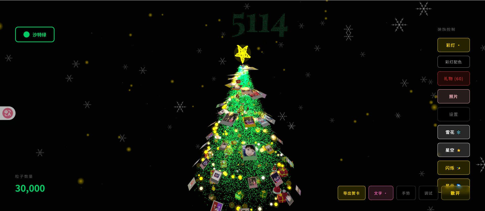
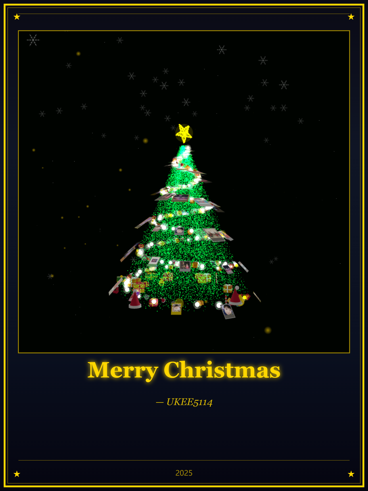

# 🎄 5114 圣诞树 - 3D 互动圣诞贺卡生成器

> **5114 特别版** - 一个超级棒的 3D 圣诞树 Web 应用！
>
> 基于 **React**, **Three.js (R3F)** 和 **AI 手势识别** 打造，支持导出精美圣诞贺卡。
>
> 🌟 **欢迎大家 Fork 并利用开源代码进一步改造！** 🌟




> *注：最新版本贺卡标题已更新为 "5114 card"*

## ✨ 核心特性

### 🎨 视觉效果

- **粒子圣诞树**：数万个发光粒子组成的树身，支持散开/聚合动画
- **粒子顶星**：五角星形状的粒子效果，颜色与彩灯同步
- **粒子文字**：支持在背景显示自定义中英文文字（如 "Merry Christmas"、"5114"）
- **照片装饰**：拍立得风格的照片悬浮在树上，支持上传自定义照片
- **圣诞礼物**：圣诞帽、圣诞袜、姜饼人、礼盒、铃铛、拐杖糖等
- **彩灯效果**：6种预设配色方案，动态闪烁
- **背景特效**：下雪、闪耀（星空+闪烁+星云）

### 🤖 AI 手势魔法（移动端 & 桌面端）

- 通过摄像头识别手势，无需触摸即可控制场景
- 基于 MediaPipe 的高精度手势识别
- **移动端支持**：使用前置摄像头，优化检测频率

### 🎁 贺卡导出

- **高清图片导出**：2160x2700 分辨率的精美烫金贺卡
- **GIF 动图导出**：录制 2 秒动画，生成动态贺卡
- **烫金效果**：渐变金色边框、发光文字、角落装饰
- **预览功能**：导出前可预览效果，不满意可返回修改
- **照片贴纸**：随机抽取用户上传的照片，以拍立得风格散落在贺卡上
- **移动端分享**：支持 Web Share API，直接唤起系统分享菜单（微信/朋友圈）
- **自定义祝福语和署名**

### 📱 移动端适配

- **响应式布局**：自动适配手机、平板、桌面
- **触摸优化**：单指旋转、双指缩放
- **性能优化**：移动端自动降低粒子数量和渲染质量
- **相机适配**：移动端相机更近、视野更宽
- **手势魔法**：移动端也支持摄像头手势控制

## 🌐 浏览器支持

| 浏览器 | 支持 |
|--------|------|
| Chrome | ✅ 完全支持 |
| Edge | ✅ 完全支持 |
| Firefox | ✅ 完全支持 |
| Safari | ✅ 支持 |
| 夸克浏览器 | ✅ 支持 |
| QQ浏览器 | ✅ 支持 |
| 微信内置浏览器 | ✅ 支持 |
| IE | ❌ 不支持 |

## 🎮 操作说明

### 界面控制

| 位置 | 功能 |
|------|------|
| 左上角 | 树颜色选择（8种预设 + 自定义） |
| 右侧面板 | 装饰控制：种树、点灯、挂礼物、挂照片、下雪、闪耀 |
| 右下角 | 导出贺卡、写祝福、手势魔法、调试、圣诞魔法/消失 |
| 左下角 | 粒子数量显示 |

### 手势魔法（移动端 & 桌面端）

点击「手势魔法」或「📷魔法」按钮开启摄像头，支持以下手势：

| 手势 | 功能 |
|------|------|
| ✋ 张开手掌 | 消失（粒子散开） |
| ✊ 握拳 | 圣诞魔法（聚合成树） |
| 👍 竖起大拇指 | 点灯（切换彩灯） |
| 👎 大拇指向下 | 挂礼物（切换礼物） |
| ✌️ 胜利手势 | 切换照片显示 |
| ☝️ 指向上方 | 换颜色 |
| 🤟 我爱你 | 切换调试模式 |

### 移动端操作

| 操作 | 功能 |
|------|------|
| 单指滑动 | 旋转视角 |
| 双指捏合 | 缩放视图 |
| 点击按钮 | 控制各项功能 |
| 📷魔法 | 开启摄像头手势控制 |

## 🛠️ 技术栈

- **框架**: React 18 + TypeScript + Vite
- **3D 引擎**: React Three Fiber (@react-three/fiber)
- **3D 工具**: @react-three/drei
- **数学库**: maath
- **AI 手势**: MediaPipe Tasks Vision
- **GIF 生成**: gif.js

## 🚀 快速开始

```bash
# 克隆项目
git clone https://github.com/YUKEE-spec/christmas-tree-main.git

# 安装依赖
npm install

# 启动开发服务器
npm run dev

# 构建生产版本
npm run build
```

## 📁 项目结构

```
├── public/
│   ├── models/              # AI 模型文件
│   │   └── gesture_recognizer.task
│   ├── photos/              # 默认照片 (1.jpg - 20.jpg, top.jpg)
│   └── gif.worker.js        # GIF 编码 Worker
├── src/
│   ├── components/
│   │   ├── Experience.tsx       # 3D 场景主组件
│   │   ├── GestureController.tsx # 手势识别
│   │   ├── ParticleText.tsx     # 粒子文字
│   │   ├── ExportCard.tsx       # 贺卡导出（烫金效果）
│   │   ├── TreeConfig.tsx       # 树配置面板
│   │   ├── LightConfig.tsx      # 彩灯配置
│   │   ├── PhotoConfig.tsx      # 照片配置
│   │   ├── GiftConfig.tsx       # 礼物配置
│   │   ├── SettingsConfig.tsx   # 设置面板
│   │   └── EnhancedGifts.tsx    # 礼物组件
│   └── App.tsx                  # 主应用（含移动端适配）
└── index.html                   # 入口（含浏览器兼容性检测）
```

## ⚙️ 配置选项

### 树颜色

沙特绿、北满金、新加坡红、冠军紫、银河银、LV橙、瑞士蓝、小豆包白

### 彩灯配色

经典金银、暖金色调、冷银色调、彩虹经典、温暖色调、冰雪色调

### 粒子数量

- 轻量(5000) - 适合低配设备
- 标准(10000) - 移动端默认
- 华丽(18000)
- 极致(30000) - 桌面端默认

### 树形状

经典锥形（默认）、螺旋塔

## 🎴 贺卡效果

导出的贺卡具有以下特点：

- **烫金边框**：渐变金色（深金→亮金→米白→亮金→深金）
- **圣诞树醒目**：占据贺卡 70% 面积
- **发光文字**：双层发光效果的祝福语
- **精致装饰**：四角星星、角落花纹、装饰线
- **高分辨率**：2160x2700 像素（适合打印和分享）

## 🤝 贡献

欢迎提交 Issue 和 Pull Request！

如果你有好的想法或改进，欢迎：

1. Fork 本项目
2. 创建你的特性分支 (`git checkout -b feature/AmazingFeature`)
3. 提交你的改动 (`git commit -m 'Add some AmazingFeature'`)
4. 推送到分支 (`git push origin feature/AmazingFeature`)
5. 开启一个 Pull Request

## 📄 License

MIT License - 自由使用、修改和分发

---

🎄 **5114 祝大家圣诞快乐！** ✨

Made with ❤️ by ukee5114
