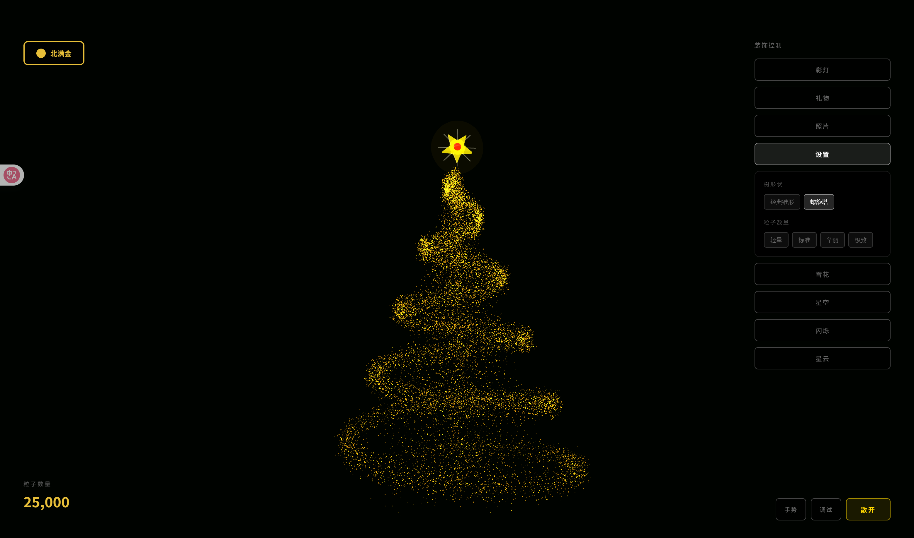

# 🎄 5114 圣诞树 - 3D 互动圣诞贺卡生成器

> **5114 特别版** - 一个超级棒的 3D 圣诞树 Web 应用！
> 
> 基于 **React**, **Three.js (R3F)** 和 **AI 手势识别** 打造，支持导出精美圣诞贺卡。
> 
> 🌟 **欢迎大家 Fork 并利用开源代码进一步改造！** 🌟



## ✨ 核心特性

### 🎨 视觉效果
- **粒子圣诞树**：数万个发光粒子组成的树身，支持散开/聚合动画
- **粒子顶星**：五角星形状的粒子效果，颜色与彩灯同步
- **粒子文字**：支持在背景显示自定义中英文文字（如 "Merry Christmas"、"5114"）
- **照片装饰**：拍立得风格的照片悬浮在树上，支持上传自定义照片
- **圣诞礼物**：圣诞帽、圣诞袜、姜饼人、礼盒、铃铛、拐杖糖等
- **彩灯效果**：6种预设配色方案，动态闪烁
- **背景特效**：雪花、星空、闪烁、星云

### 🤖 AI 手势控制
- 通过摄像头识别手势，无需触摸即可控制场景
- 基于 MediaPipe 的高精度手势识别

### 🎁 贺卡导出
- **高清图片导出**：2400x3200 分辨率的精美贺卡
- **GIF 动图导出**：录制 2 秒动画，生成动态贺卡
- 自定义祝福语和署名

## 🎮 操作说明

### 界面控制
| 位置 | 功能 |
|------|------|
| 左上角 | 树颜色选择（8种预设 + 自定义） |
| 右侧面板 | 装饰控制（彩灯、礼物、照片、设置、雪花、星空、闪烁、星云） |
| 右下角 | 导出贺卡、文字、手势、调试、聚合/散开按钮 |
| 左下角 | 粒子数量显示 |

### 手势控制
开启手势后，支持以下手势：

| 手势 | 功能 |
|------|------|
| ✋ 张开手掌 | 散开粒子 |
| ✊ 握拳 | 聚合成圣诞树 |
| 👍 竖起大拇指 | 切换彩灯颜色方案 |
| 👎 大拇指向下 | 切换礼物显示/隐藏 |
| ✌️ 胜利手势 | 切换照片显示/隐藏 |
| ☝️ 指向上方 | 切换树的颜色 |
| 🤟 我爱你 | 切换调试模式 |
| 左右移动 | 控制旋转方向 |

## 🛠️ 技术栈

- **框架**: React 18 + TypeScript + Vite
- **3D 引擎**: React Three Fiber (@react-three/fiber)
- **3D 工具**: @react-three/drei
- **数学库**: maath
- **AI 手势**: MediaPipe Tasks Vision
- **GIF 生成**: gif.js

## 🚀 快速开始

```bash
# 克隆项目
git clone https://github.com/your-repo/christmas-tree.git

# 安装依赖
npm install

# 启动开发服务器
npm run dev

# 构建生产版本
npm run build
```

## 📁 项目结构

```
├── public/
│   ├── models/              # AI 模型文件
│   │   └── gesture_recognizer.task
│   ├── photos/              # 默认照片 (1.jpg - 20.jpg, top.jpg)
│   └── gif.worker.js        # GIF 编码 Worker
├── src/
│   ├── components/
│   │   ├── Experience.tsx       # 3D 场景主组件
│   │   ├── GestureController.tsx # 手势识别
│   │   ├── ParticleText.tsx     # 粒子文字
│   │   ├── ExportCard.tsx       # 贺卡导出
│   │   ├── TreeConfig.tsx       # 树配置面板
│   │   ├── LightConfig.tsx      # 彩灯配置
│   │   ├── PhotoConfig.tsx      # 照片配置
│   │   ├── GiftConfig.tsx       # 礼物配置
│   │   ├── SettingsConfig.tsx   # 设置面板
│   │   └── EnhancedGifts.tsx    # 礼物组件
│   └── App.tsx                  # 主应用
└── index.html
```

## ⚙️ 配置选项

### 树颜色
沙特绿、北满金、新加坡红、冠军紫、银河银、LV橙、瑞士蓝、小豆包白

### 彩灯配色
经典金银、暖金色调、冷银色调、彩虹经典、温暖色调、冰雪色调

### 粒子数量
轻量(5000)、标准(10000)、华丽(18000)、极致(30000)

### 树形状
经典锥形、螺旋塔

## 🤝 贡献

欢迎提交 Issue 和 Pull Request！

如果你有好的想法或改进，欢迎：
1. Fork 本项目
2. 创建你的特性分支 (`git checkout -b feature/AmazingFeature`)
3. 提交你的改动 (`git commit -m 'Add some AmazingFeature'`)
4. 推送到分支 (`git push origin feature/AmazingFeature`)
5. 开启一个 Pull Request

## 📄 License

MIT License - 自由使用、修改和分发

---

🎄 **5114 祝大家圣诞快乐！** ✨

Made with ❤️ by ukee5114
